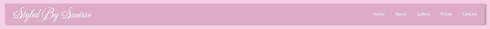
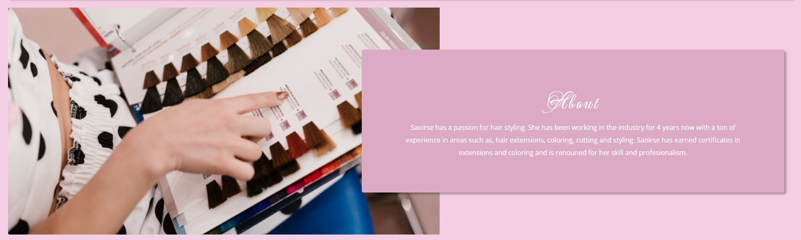

## Stayed by Saoirse 

 Styled by Saoirse is a site that helps the user view and book hair styling sessions. The site will target both existing and potential customers and can show them images of previous work, price lists, and how to contact them. 
 I aim to have a site that can make the business look professional and help boost customer experience.

 

## Features 

### Existing Features

- __Navigation Bar__

  - Featured at the top of the page, the full responsive navigation bar includes links to  Home, the About section, the Gallery section, and the Contact section to allow for easy navigation to all aspects of the page.
  - This section will allow the user to easily navigate to the section they desire across all devices. 

- __The About Section__

  - The landing includes a photograph with a floating About section to give the user some basic information about the owner. 
  - This section introduces the user to Styled by Saoirse with an eye-catching layout to grab their attention

- __Gallery Section__

  - The Gallery section will allow the user to see previous customers and get an idea of what to expect from Styled by Saoirse. 
  - This should help the user to decide on which service they would like to purchase. 

- __Contact Section__

  - This section will allow the user to see the best ways to contact the owner. 

- __The Footer__ 

  - The footer section includes links to the relevant social media sites Styled by Saoirse. The links will open the home page to the relevant link to allow easy navigation for the user. 
  - The footer is valuable to the user as it encourages them to keep connected via social media

### Features Left to Implement

- In the future, I would introduce a section where the user can see an up-to-date calendar on available times.
- In the future, I would introduce a functioning booking system where the user can book a time slot that would go directly to the owner's calendar.

## Testing 

- In testing for this project I initially came across a lot of issues on reactive viewing where some aspects of the page didn't react as I would have liked. Through trial and error, I eventually got the page to react as I would have liked in different viewpoints. 
I tried to focus on desktop and mobile views as I thought that these would be the most commonly used. 
I spent a lot of time trying to get the image slider to look its best, I found it quite time-consuming and had to rely heavily on online videos and forums for help. 
I also found myself going back through a lot of our lessons to get some information on how to center certain Divs and also on the general layout of the page.

- I think the page looks best in desktop view and although mobile view works well it could look a lot better. If I had more time available to me I would spend it working out the kinks there. Overall I'm happy with how the page turned out in terms of aesthetics, but there's always room for improvement.

- Some of the more interesting bugs I came across working on the page came from adjusting for different viewpoints. When I had first incorporated the image slider it was a bit of a mess, the images would stack on top of each other, they would stretch and drag out the page and out of focus and sometimes just disappear. This was the biggest learning experience for me. Throughout the testing of this, I would have to go back through our online lessons, ask questions on online forums, ask fellow students for advice and watch some YouTube videos with better information on how to properly incorporate an image slider correctly. The image slider didn't turn out exactly how I would like, I know that it is a bit off-center and could be a lot more clean-looking.

### Validator Testing 

- HTML
  - No errors were returned when passing through the official [W3C validator](https://validator.w3.org/nu/?doc=https%3A%2F%2Fcode-institute-org.github.io%2Flove-running-2.0%2Findex.html)
- CSS
  - No errors were found when passing through the official [(Jigsaw) validator](https://jigsaw.w3.org/css-validator/validator?uri=https%3A%2F%2Fvalidator.w3.org%2Fnu%2F%3Fdoc%3Dhttps%253A%252F%252Fcode-institute-org.github.io%252Flove-running-2.0%252Findex.html&profile=css3svg&usermedium=all&warning=1&vextwarning=&lang=en#css)

### Unfixed Bugs

- I'm aware of certain bugs in the page, such as the centering of the image slider. I would like it to be more centered but whenever I tried doing so I made it worse. I would also like the image slider to have an image selected when first opening the page.

## Deployment

- The site was deployed to GitHub pages. The steps to deploy are as follows: 
  - In the GitHub repository, navigate to the Settings tab 
  - From the source section drop-down menu, select the Master Branch
  - Once the master branch has been selected, the page will be automatically refreshed with a detailed ribbon display to indicate the successful deployment. 

The live link can be found here - https://e01n.github.io/Project-1/ 

## Credits 

### Content 

- I took inspiration for the NavBar from a YouTube channel [Online-Tutorials](https://www.youtube.com/watch?v=kEt5DCHeyJo&list=LL&index=8&t=199s&ab_channel=OnlineTutorials)
- The About Section was developed with help from [Computer Science](https://www.youtube.com/watch?v=pt26fbKaoqM&ab_channel=ComputerScience)
- Instructions on how to create the image slider was taken from a YouTube channel [FrontEndDesign](https://www.youtube.com/watch?v=yirix3tA61Q&ab_channel=FrontEndDesign) with additional help from [SitePoint Community](https://www.sitepoint.com/community/t/trying-to-prevent-an-image-slider-from-stretching-page-horizontally/383856)
- The icons in the footer were taken from [Font Awesome](https://fontawesome.com/)
- The fonts I used are from [Google Fonts](https://fonts.google.com/)
### Media

- The photos used on the home and sign up page are from 
- The images used for the gallery page were taken from Styled by Saoirse's gallery

## Further Comments

I made a huge mistake by not labeling my commit changes. I had not taken into account how important these comments are and have learned a valuable lesson going forward to properly document changes made to my code as I progress through a project. In a way I am glad that this happened as I was annoyed at myself for making this mistake but this is how I will learn and progress further in my career as a developer. 
