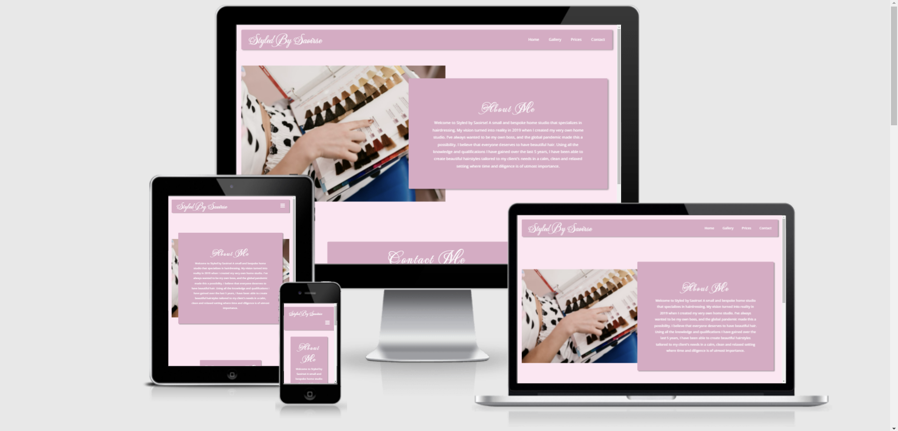
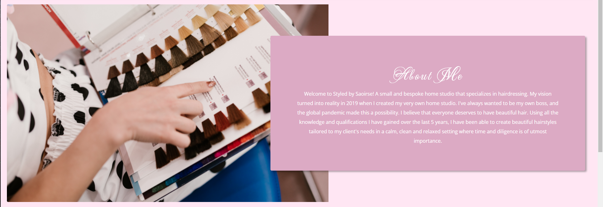
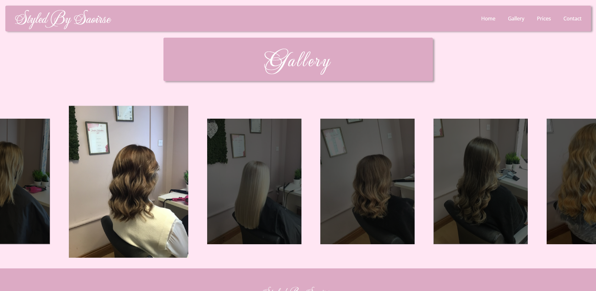

## Stayed by Saoirse 

 Styled by Saoirse is a site that helps the user view and book hair styling sessions. The site will target both existing and potential future customers and show them images of previous work, price lists, and how to contact the owner. 
 I aim to have a site that can make the business look professional and help boost customer experience.

 

## [View the deployed website here!](https://e01n.github.io/Project-1/)
---

## Features 

### Existing Features

- __Navigation Bar__

  - Featured at the top of the page, the full responsive navigation bar includes links to  the Homepage, the Gallery page, the Prices page and the Contact section to allow for easy navigation to all aspects of the page.
  - This section will allow the user to easily navigate to the section they desire across all devices. 
  - The navigation bar is situated at the top of all pages so the user can easily transition between sections and pages.
  - When clicked the user will be brought to the corresponding place. The gallery tab will bring the user to the gallry page with the same for the prices tab, but the cvontact tab will bring the user directly to Styled by Saoirse's Instagram page.
  - When browsing in 600 pixals or less the Nav Bar changes to show a burger icon, and when clicked will show a drop down menu.

- __The About Section__

  - The About section is based on the homepage of the site and will be the first thing the user will interact with.
  - This section includes a photograph with a floating About section to give the user some basic information about the owner. 
  - This section introduces the user to Styled by Saoirse with an eye-catching layout to grab the attention of the user.
  - In a screen size of 600 pixals or less the background image will disapear and center the About section for optimal viewing.

- __Gallery Page__

  - I created an interactive gallery page with an image slider showing images of previous customers.
  - The Gallery page will allow the user to see previous work to get an idea of what to expect from Styled by Saoirse. 
  - This should help the user to decide on which service they would like to purchase. 
  - In a screen size of 600 pixals or less the image slider changes to be optimal for mobile users.

- __Prices Page__

  - The Prices page displays a selection of services available with corrisponding prices.
  - When the user hovers over each card an animation is activaded which changes the card colour.
  - When the 'Book Now' button is clicked it will open a new tab to Styled by Saoirse's Instagram page where the user can then book a time.
  - In a screen size of 600 pixals or less the prices cards move to be displayed vertically for optimized viewing on smaller screens.

Price Card             |  Price Card Hover
:-------------------------:|:-------------------------:
  |  

- __Contact Section__

  - I wanted the contact section to be simple and straight forward so that the user can easily find the information that they are looking for.
  - This section will allow the user to see the best ways to contact the owner. 
  - The contact section will shrink and grow in size depending on screen size.

- __The Footer__ 

  - The footer is situated on the bottom of all three pages to give the user access to the social media tags.
  - The footer section includes links to the relevant social media sites. The links will open a new tab to the relevant link to allow easy navigation for the user. 
  - The footer is valuable to the user as it encourages them to keep connected via social media.

### Features Left to Implement

- I would like to introduce a section where the user can see an up-to-date calendar on available times.
- I would like to introduce a functioning booking system where the user can book a time slot that would go directly to the owner's calendar.
- I would like to a live instagram feed so the user can see the latest word done by Styled by Saoirse.
- I would like to introduce the option to purchase e-gift vouchers so that users can send the voucher to a friend or family member.

## Testing 

- In testing for this project I initially came across a lot of issues on reactive viewing where some aspects of the pages didn't react as I would have liked. Through trial and error, I eventually got the pages to react as I would have liked in different viewpoints. 
I tried to focus on desktop and mobile views as I thought that these would be the most commonly used. 
I spent a lot of time trying to get the image slider to look its best, I found it quite time-consuming and had to rely heavily on online videos and forums for help. 
I also found myself going back through a lot of our lessons to get some information on how to center the slider and also on the general layout of the page.

- I think the site looks best in desktop view and although mobile view works well. Overall I'm happy with how the page turned out in terms of aesthetics, but there's always room for improvement.

- Some of the more interesting bugs I came across working on the page came from adjusting for different viewpoints. When I had first incorporated the image slider it was a bit of a mess, the images would stack on top of each other, they would stretch and drag out the page and out of focus and sometimes just disappear. This was the biggest learning experience for me. Throughout the testing of this, I would have to go back through our online lessons, ask questions on online forums, ask fellow students for advice and watch some YouTube videos with better information on how to properly incorporate an image slider correctly. The image slider didn't turn out exactly how I would like, I know that it is a bit off-center and could be a lot more clean-looking.

### Validator Testing 

- HTML
  - No errors and one warning were returned when passing through the official [W3C validator](https://validator.w3.org/nu/?doc=https%3A%2F%2Fe01n.github.io%2FProject-1%2F)
- CSS
  - No errors were found when passing through the official [(Jigsaw) validator](https://jigsaw.w3.org/css-validator/validator?uri=https%3A%2F%2Fe01n.github.io%2FProject-1%2F&profile=css3svg&usermedium=all&warning=1&vextwarning=&lang=en)

### Unfixed Bugs

- I'm aware of that the centering of the image slider isn't exactly right, I would like it to be more centered. I would also like the image slider to have an image selected when first opening the page.

## Deployment

- The site was deployed to GitHub pages. The steps to deploy are as follows: 
  - In the GitHub repository, navigate to the Settings tab 
  - From the source section drop-down menu, select the Master Branch
  - Once the master branch has been selected, the page will be automatically refreshed with a detailed ribbon display to indicate the successful deployment. 

The live link can be found here - https://e01n.github.io/Project-1/ 

## Credits 

### Content 

- I took inspiration for the NavBar from a YouTube channel [Online-Tutorials](https://www.youtube.com/watch?v=kEt5DCHeyJo&list=LL&index=8&t=199s&ab_channel=OnlineTutorials)
- The About Section was developed with help from [Computer Science](https://www.youtube.com/watch?v=pt26fbKaoqM&ab_channel=ComputerScience)
- Instructions on how to create the image slider was taken from a YouTube channel [FrontEndDesign](https://www.youtube.com/watch?v=yirix3tA61Q&ab_channel=FrontEndDesign) with additional help from [SitePoint Community](https://www.sitepoint.com/community/t/trying-to-prevent-an-image-slider-from-stretching-page-horizontally/383856)
- I took inspiration for the footer from [Code Opacity](https://www.youtube.com/watch?v=zdA3qZNH1vc&t=116s&ab_channel=CodeOpacity)
- The icons in the footer were taken from [Font Awesome](https://fontawesome.com/)
- The fonts I used are from [Google Fonts](https://fonts.google.com/)
### Media

- The photos used on the home and sign up page are from Styled by Saoirse's gallery 
- The images used for the gallery page were taken from Styled by Saoirse's gallery

## Further Comments

I made a grave error by not labeling my commit changes. I had not taken into account how essential these comments are to a project. However, I have learned a valuable lesson here, and going forward i will properly document any changes I make to my code in future projects. As it was too late to rectify this error, rather than dwell on the negative, I have decided to take this as a possitive learning oppertuinity that i will take with me as I continue grow as a developer.
